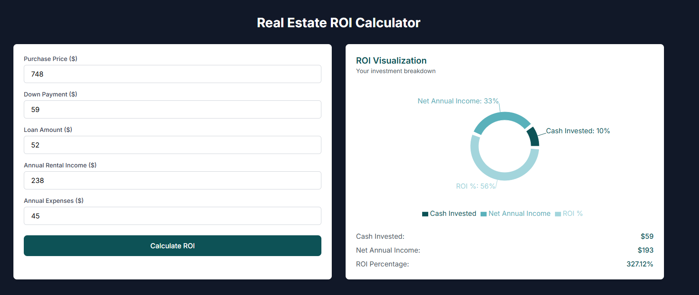

# 🏠 Real Estate ROI Calculator

A powerful investment analysis tool built with **Next.js**, **TypeScript**, and **Tailwind CSS**. Instantly calculate property investment returns by analyzing purchase price, rental income, and expenses — with clear ROI metrics and visualizations.



Live Demo: [real-estate-roi-calculator.vercel.app](https://real-estate-roi-calculator.vercel.app/)

---

## ✨ Features

- ✅ **Investment Analysis**: Input purchase price, down payment, and loan details
- 📊 **Rental Profit Calculator**: Track annual income vs. expenses
- 🧮 **Automatic ROI Calculation**: 
  - Cash Invested (Down Payment)
  - Net Annual Income (Rent - Expenses)
  - ROI% = (Net Income / Cash Invested) × 100
- 📈 **Visual Investment Breakdown**: Clear metrics presentation
- ⚡ **Responsive UI**: Works on desktop & mobile

---

## 🚀 Tech Stack

- **Framework:** [Next.js](https://nextjs.org/) (App Router)
- **Language:** [TypeScript](https://www.typescriptlang.org/)
- **Styling:** [Tailwind CSS](https://tailwindcss.com/)
- **Visualization:** [Recharts](https://recharts.org/)

---

## 📊 Example Calculation

| Input               | Value  |
|---------------------|--------|
| Purchase Price      | $748   |
| Down Payment        | $59    |
| Annual Rent         | $238   |
| Annual Expenses     | $45    |

| Output              | Value     |
|---------------------|-----------|
| **Cash Invested**   | $59       |
| **Net Income**      | $193      |
| **ROI**            | 327.12%   |

---

## 📦 Installation

```bash
git clone https://github.com/Alirazahaider/real-estate-roi-calculator
cd real-estate-roi-calculator
npm install
npm run dev
```

## 💌 Get In Touch

Thank you for checking out this project! If you have any questions, suggestions, would like to collaborate, or need my development services:

[](mailto:alicodespace@gmail.com)
[](https://www.linkedin.com/in/alirazaweb)
[](https://alicodez.vercel.app/)

⭐ Support the project by starring the repository!
[](https://github.com/Alirazahaider/real-estate-roi-calculator)
